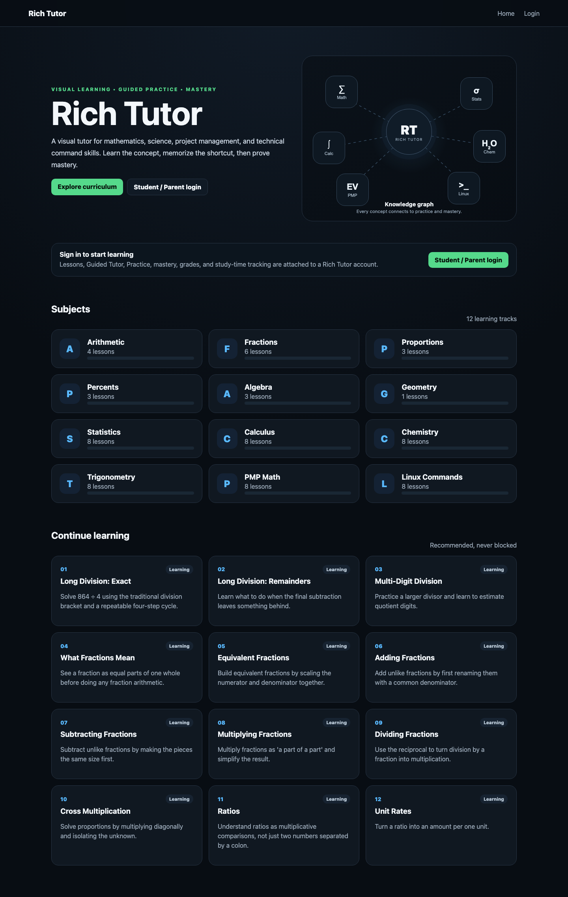
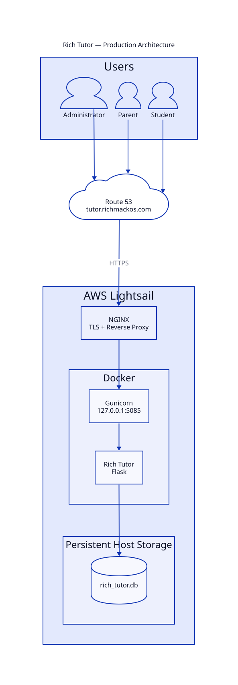
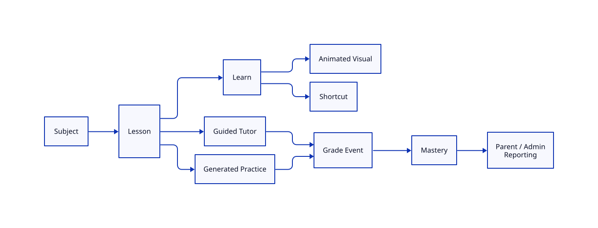
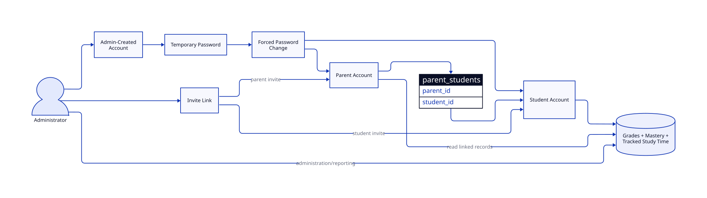
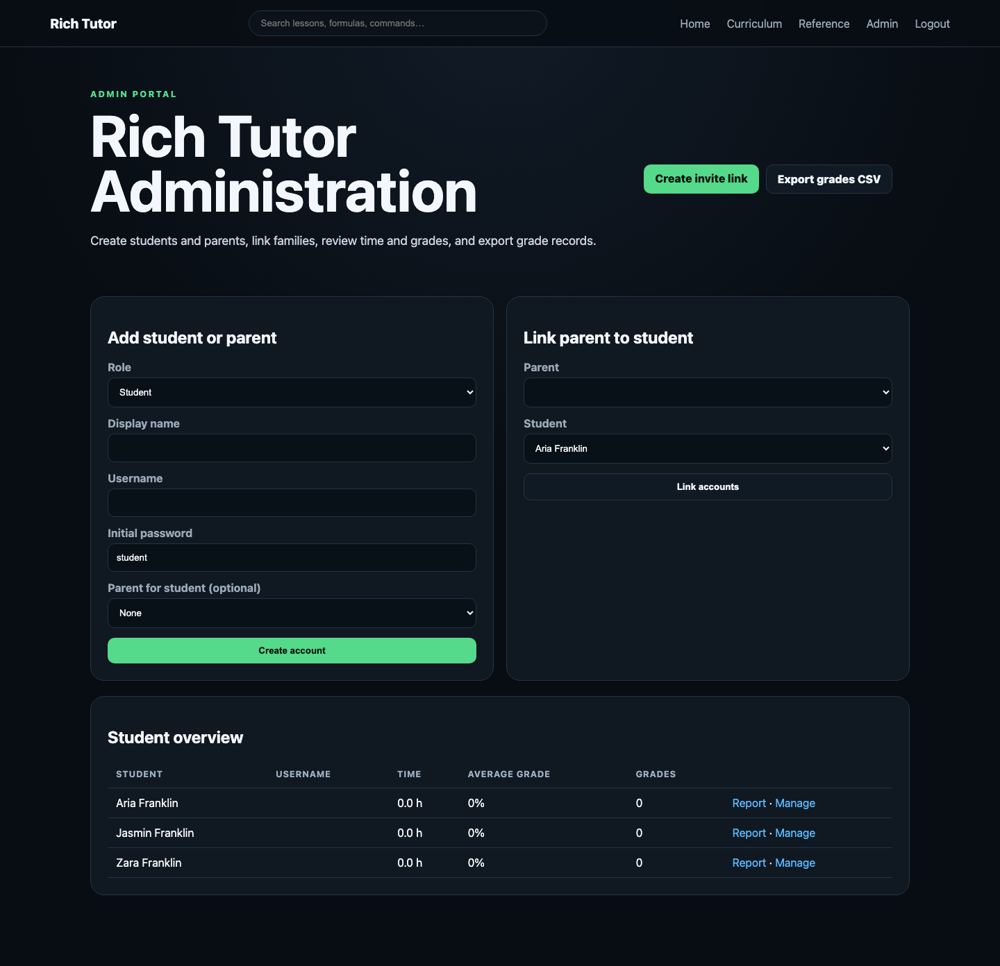
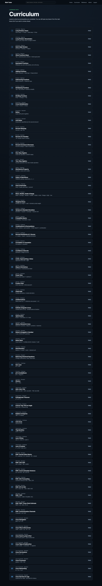
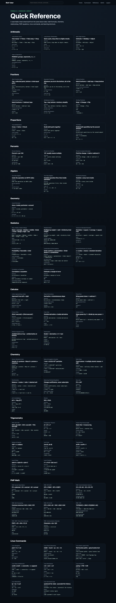
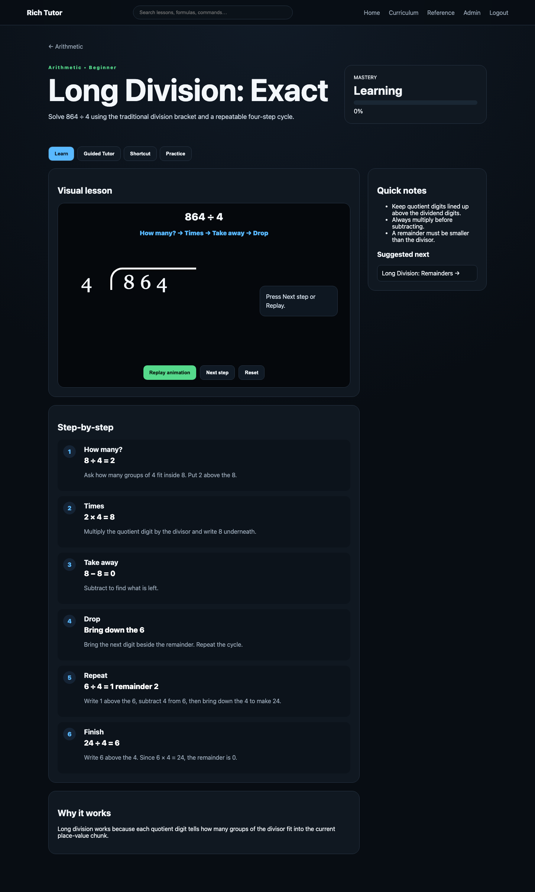
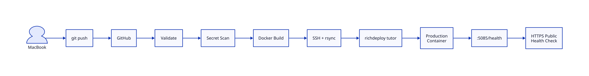

<!-- RICH-TUTOR-VISUAL-DOCS-START -->

# Rich Tutor Visual Documentation

Rich Tutor is a containerized visual learning platform with animated lessons,
guided tutoring, generated practice, mastery tracking, student accounts,
parent reporting, administrator tools, invite workflows, and automated
production deployment.

Production:

**https://tutor.richmackos.com**

## Application



The public landing page introduces the major Rich Tutor learning tracks through
an animated knowledge graph.

## Production Architecture



Production traffic follows:

`Browser → Route 53 → NGINX/TLS → Gunicorn → Flask → SQLite`

Gunicorn is exposed only on `127.0.0.1:5085` behind NGINX.

## Learning Engine



A lesson can combine:

- visual instruction
- animated explanation
- memory shortcuts
- Guided Tutor checkpoints
- generated practice
- grading
- mastery tracking
- parent/admin reporting

## Account and Family Model



Rich Tutor includes:

- administrator accounts
- student accounts
- parent accounts
- single-use invitation links
- temporary password workflows
- forced password changes
- parent/student relationships
- account enable/disable controls
- administrator password resets

## Administrator Portal



Administrators can create and manage students and parents, link family
relationships, review student data, manage invitations, and export grades.

## Invitation Management


Invitation URLs allow students and parents to create their own credentials.
Student invitations can also establish a parent relationship automatically.

## Curriculum



Rich Tutor has expanded beyond its original arithmetic lessons into a broader
technical learning platform.

Subject areas include:

- arithmetic
- fractions
- algebra
- statistics
- trigonometry
- calculus
- chemistry
- Linux
- PMP mathematics

## Formula and Command Reference



The reference library combines mathematical formulas, learning shortcuts,
technical commands, and subject-specific reference material.

## Lesson Experience



Lesson pages combine detailed written instruction with interactive visual
teaching, shortcuts, Guided Tutor mode, and generated practice.

## CI/CD Architecture



Production deployments use:

`git push → GitHub Actions → validation → secret scan → Docker build → rsync → richdeploy tutor → health verification`

The pipeline verifies both the local production backend and the public HTTPS
health endpoint.

## Technology

- Python
- Flask
- SQLite
- Werkzeug
- Gunicorn
- Docker
- Docker Compose
- NGINX
- AWS Lightsail
- Route 53
- GitHub Actions
- D2
- Manim
- Playwright

<!-- RICH-TUTOR-VISUAL-DOCS-END -->


# Rich Tutor

No-login Flask math learning app with:
- 20 detailed starter lessons
- browser-based 2D/SVG/CSS animations
- memory shortcuts and worked examples
- Manim batch rendering
- expansion roadmap for PMP math, trigonometry, and calculus

## Run the Flask app

```bash
cd math-tutor
./run.sh
```

Open: http://127.0.0.1:5055

## Render all 20 Manim videos

The app is intentionally LaTeX-free.

```bash
cd math-tutor
source .venv/bin/activate
QUALITY=l ./scripts/render_all.sh
```

For HD:

```bash
QUALITY=h ./scripts/render_all.sh
```

Rendered videos are copied to `static/videos/`.

## Add lessons

Edit `lessons/lessons.json`. Flask loads the file dynamically.

The roadmap already reserves curriculum space for:
- PMP formulas: PERT, EVM, CPI, SPI, EAC, ETC, TCPI, communication channels
- Trigonometry: SOH-CAH-TOA, unit circle, radians, identities, laws of sines/cosines
- Calculus: limits, derivatives, chain/product rules, integrals, optimization


## Repaired build

The repaired build:
- uses lesson-specific animation data instead of hard-coded 864 ÷ 4
- correctly animates 875 ÷ 4 with remainder 3
- adds Replay / Next step / Reset controls
- hides the HTML video player until the corresponding MP4 actually exists
- fixes rendered-video destination names to exactly match `lessons.json`
- keeps the browser animations usable even before Manim videos are rendered

Run:

```bash
./repair_and_run.sh
```

Render all videos separately:

```bash
source .venv/bin/activate
QUALITY=l ./scripts/render_all.sh
```


## Learning-platform upgrade

Added:
- Learn / Shortcut / Practice tabs
- unlimited generated practice for major lesson types
- answer checking, hints, streaks, attempts
- local-only progress tracking using browser localStorage
- curriculum dashboard with prerequisite-based locked/ready/complete states
- difficulty selector
- no account or database required

All progress remains on the device/browser.


## Curriculum expansion

Added 48 detailed lessons across:
- Statistics
- Calculus
- Chemistry
- Trigonometry
- PMP Math
- Linux Commands

Each follows the same Learn / Shortcut / Practice structure, local progress model,
practice generator architecture, and Manim-compatible lesson data model.

Total lesson count in this build: 68.


## Product upgrade V5

Added:
- no hard lesson locks; sequencing is recommendation-only
- per-lesson mastery: Learning / Practicing / Mastered
- Guided Tutor mode with checkpoint questions, hints, reveals, and mastery scoring
- subject dashboards
- global search across lessons, shortcuts, formulas, commands, and tags
- formula/command quick-reference library
- previous/next lesson navigation
- separate-subdomain deployment assets under `deploy/`


## Rich Tutor accounts and portals

Default admin account for first local login:

- Username: `admin`
- Password: `admin`

Change the password before exposing the application publicly.

Roles:
- Admin: create parents/students, link families, view all student reports, export grades.
- Parent: view only linked students, time, grades, and mastery; export their linked grades.
- Student: normal learning interface with automatic lesson time tracking and server-side grade/mastery recording.

Database: `data/rich_tutor.db` (SQLite).


## V8: Invitations + animated home

- Admin one-time invite-link generator for parent and student accounts.
- Student invitations can auto-link the new account to an existing parent.
- Invite expiration and used-state tracking.
- Animated home-page knowledge graph representing Math, Statistics, Chemistry, Linux, PMP, and Calculus.
- Accessible click/tap topic readout and reduced-motion support.

Admin invitation manager: `/admin/invites`.


## V9: authenticated learning access

Public without login:
- animated homepage
- login
- invitation acceptance

Authentication required:
- subject dashboards
- lessons
- Guided Tutor
- practice
- curriculum
- reference library
- search
- roadmap

Admin and Parent portals retain their role-specific access controls.


## Container / CI/CD production baseline

Rich Tutor is containerized for production with Docker Compose, localhost-only
port binding, persistent `./data:/app/data`, Gunicorn, `/health`, deployment
scripts, and GitHub Actions CI/CD. See `DEPLOYMENT.md`.


## V10: account management

- Admin-created parent/student accounts get `must_change_password=1`.
- First successful login forces a password change before accessing the app.
- Invite-created users choose their own password and are not forced to change it.
- Admin can manage any parent/student account, disable/enable it, reset its password,
  and link/unlink parent/student relationships.
- Password resets force a new password on the next login.
